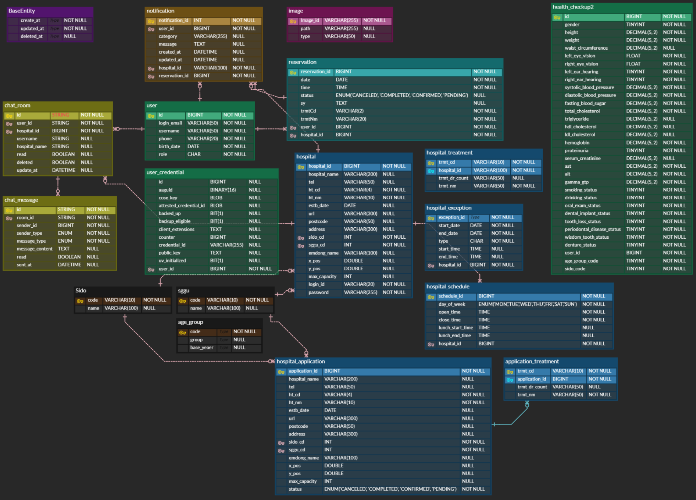
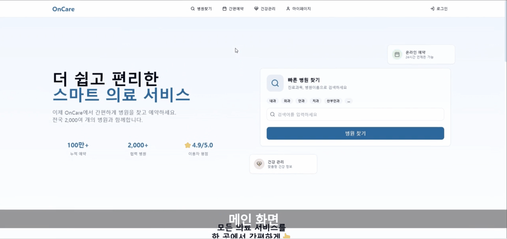
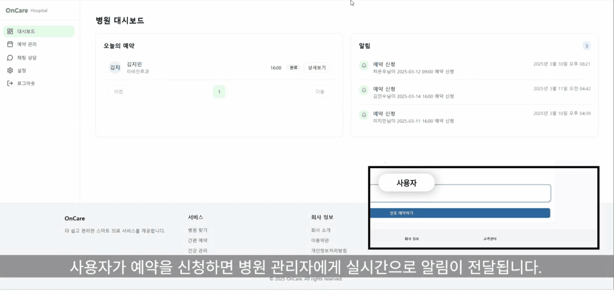

# on-care - 병원 예약 및 건강 검진 내역 관리 서비스

 

## 📘 프로젝트 진행 기간

2025.02.10 ~ 2025.03.12 (4주)

 

## 💁 총 인원

3명

 

## 🏅 On-care - 배경

● CES 2025의 핵심 키워드로 '디지털 헬스케어' 선정 
● 글로벌 트렌드에 발맞춰 디지털 헬스케어 시장의 급성장과 증가하는 수요에 선제적 대응 
● 기존 병원 예약 시스템의 불편함을 해소하고 사용자 중심의 개인 맞춤형 건강 관리 서비스 제공 필요 

> "기존 예약 시스템이 너무 불편하고 복잡해요. 더 간편하고 내게 맞는 건강 관리 서비스는 없을까요?" 
> "내 건강 상태를 정확히 알고 맞춤형 관리로 건강을 챙기고 싶어요!"

이러한 고민을 해결하고자 **개인 맞춤형 디지털 헬스케어 서비스**가 탄생했습니다.

**기대효과**
- 병원 운영 효율성 증가
- 의료 서비스 접근성 향상
- 개인 건강 관리 효율성 증대

이제, 병원과 개인 모두가 스마트하게 건강을 관리할 시간입니다! 🚀

 

## ✔ 주요 기술

**Backend**
-   Spring Boot, Spring Data JPA
-   AWS EC2, ACM, Route53, ALB, S3, RDS, Nginx, Jenkins, GitHub Action, Gabia
-   Git, GitHub, Notion

**Frontend**
-   React, React Router, Zustand, Axios, Tailwind CSS

 

## ✔ 담당 역할
-   AWS를 활용한 CI/CD 인프라 구축
-   OAuth2를 통한 카카오 로그인, JWT를 활용한 인증 및 인가
-   WebAuthn4j 라이브러리를 활용한 패스키 인증 구현
-   SSE를 활용한 알림 기능 구현
-   S3 이미지 업로드 및 최적화
-   공공데이터를 활용한 사용자 건강검진내역 데이터 조회
-   리뷰, 즐겨찾기 CRUD 기능

 

## ✔ ERD

 

## ✔ 시스템 아키텍쳐

 

## ✔ 트러블 슈팅 및 고민

### 🚀 문제 1: AWS S3 저장 비용 부담
- **문제**: AWS S3에 원본 이미지를 그대로 저장하려니 용량이 크고 비용 부담이 커짐.  
- **해결**: Webp 확장자 변환, 이미지 사이즈 축소 등 최적화 기법을 적용해 약 **93% 용량 감소** 효과를 얻었고, 결과적으로 S3 사용 비용을 절감함.

---

### 🔔 문제 2: 알림 기능의 코드 중복 문제
- **문제**: 회원과 병원 모두 알림 기능을 지원해야 하는데, 로직이 유사함에도 불구하고 다른 데이터 형식으로 인해 **중복 코드가 많아져** 코드 가독성과 유지보수가 어려워질 것으로 예상됨.  
- **해결**: Service 레이어에서 `NotificationReceiver` 인터페이스를 두어 **공통 로직**(SSE 등록, 알림 DB 저장, SSE push 등)을 처리함으로써 **추상화를 적용**, 코드 중복을 줄이고 유지보수를 용이하게 함.

---

### 💰 문제 3: AWS 비용 절감 필요
- **문제**: 프로젝트 지원 종료로 **EC2, ACM, Route53 등 AWS 관련 비용 절감**이 필요했음.  
  - t2.micro EC2에 Jenkins를 통해 CI/CD를 구축하려 했지만 리소스 부담으로 실패함.  
- **해결**:  
  - **CI/CD**: Jenkins는 해당 인스턴스의 자원을 필요로 하기 때문에 **GitHub Action으로 전환**  
  - **SSL 인증서**: ACM 대신 **Nginx + CertBot**을 활용하여 적용  
  - **DNS 비용 절감**: Route53 대신 **Gabia에서 DNS 레코드 설정**
 
 

## 🎵 On-care 서비스 화면

---

### 메인화면(일반 사용자)

### 메인화면(병원 관리자)

### 메인화면(서비스 관리자)

 
 

### 카카오 로그인

 
 

### 패스키 로그인

 
 

### SSE 알림

 
 

### 건강 검진 내역 조회

 
 

### 리뷰 및 즐겨찾기

